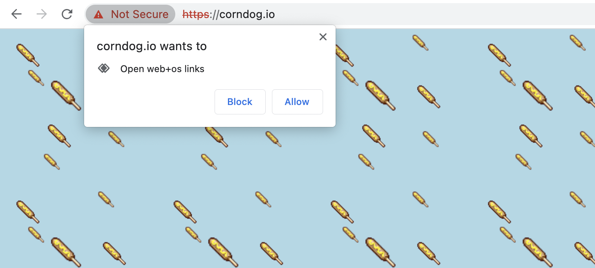

# web-os-standard v0.1
Open-source standard for the protocol handler web+os
### The [demo](//system41.github.io/web-os-standard/demo) is now available

The web os standard allows for compatible use of web OSes. It is a simple web protocol, `web+os` that allows for information to be shared between many web desktops. This is done by registering a Protocol Handler on the `navigator` object inside `window`, using `navigator.registerProtocolHandler`. To learn more about this method, read the [MDN docs](https://caniuse.com/registerprotocolhandler) and view the [specification](https://html.spec.whatwg.org/multipage/system-state.html#custom-handlers). Not only can information be shared from a web OS to a web OS, but a normal website and even anything that supports HTTP can use it.
> 
> A website registering the service worker  

**Important:** `window.navigator.registerProtocolHandler` only works on Chrome, Edge, Firefox, and Opera. It does not work on any mobile browsers. For more info, see the [caniuse](https://caniuse.com/registerprotocolhandler) page.
## Protocol
Your Web OS protocol URL can take two approaches; one executing an app, command, or module (we'll just call this 'app') and the other leading to a file, directory, or drive (we'll just call this 'file'). The part(s) after `web+os:` are called elements.
### App approach
```web+os:app/options```  
The app element should execute an application. The `app` and `options` elements in the protocol may not contain a forward slash (/) or a backslash (\\). *These are the only limitations of this approach.* Although we do recommend that you do not include spaces or capital letters, you may do so if you wish. The parser will not misinterpret the protocol if you do these things.
### File approach
```web+os:file```  
The only element in this approach is `file`. This should be a path to a file, drive, or directory. This *can* include frons slashes and backslashes. If it is a directory or drive, the default file explorer/manager should open and show the directory or drive. If the file element is a file, the file's default opener should open it.
<!-- TODO: DO's and DON'ts, also add more approaches -->
